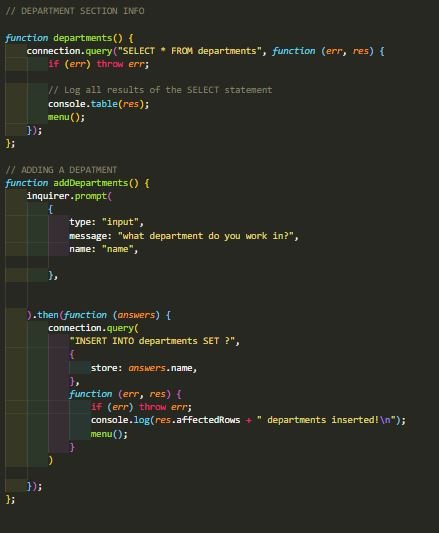
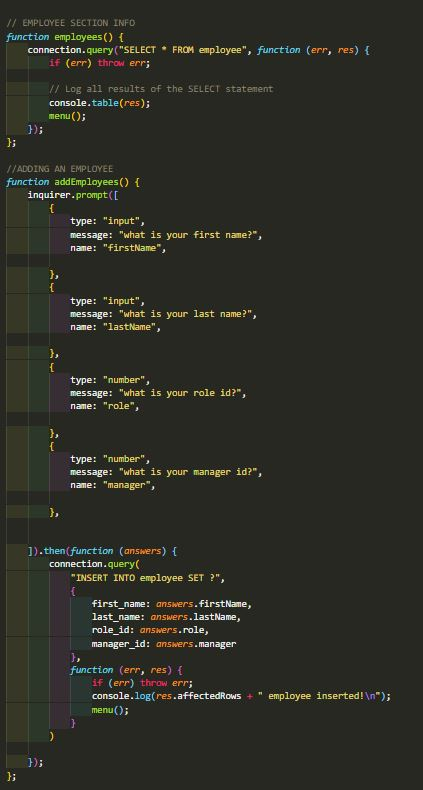
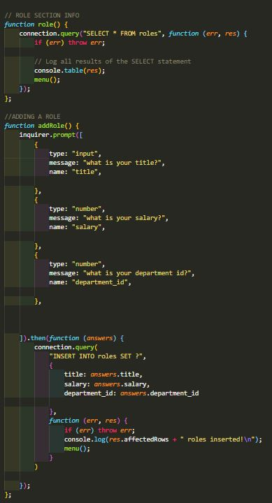
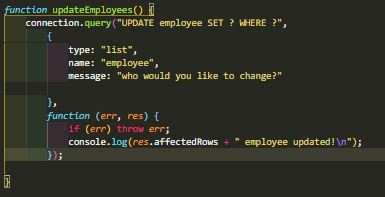
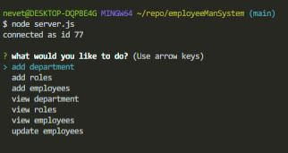

# Instructions
```
In this assignment we needed to make some input functions where we could add employees, add roles, add departments, view employees, view roles, view departments, and update employees
```

## Department

```
I made prompts that asked user for input data asking what department someone works in
```



## employee

```
I made prompts that asked user for input data asking what someone is considered as in the work environment
```


## Roles

```
I made prompts that asked user for input data asking what role someone is considered in the work environment
```


## Update 

```
in this section I created a function that would allow a user to update previous input data stored in the menu
```

### Test
```
In this picture I am displaying the options of what the user can choose
```
